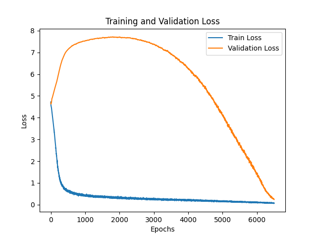
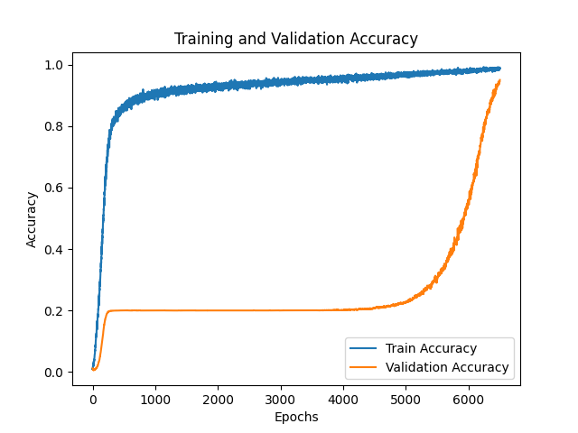

# Grokking

Trying to figure out why it happens. Grokking is a phenomenon wherein, a model (transformer in this case) initially fully "memorizes" the training dataset and thus overfits, after thousands of epochs is able to generalize perfectly to the validation set, which it has never seen before. To reproduce this, a train-test split of 20/80 is used, i.e only 20% of the full dataset is given to the model at training. This is a very interesting phenomenon as the model seemingly over just a few epochs towards the end, is able to perfectly generalize and understand the underlying mathematical principles.

## Setup
Transformer Architecture is as follows:
- 64 embedding dimension with a "vocab" size of 98 => 0-96 as numbers and '=' sign.
- a single layer transformer with 4 attention heads.
- a fully connected layer with 97 output nodes.
- Cross entropy loss 
- AdamW optimizer with a weight decay of 0.5 (This is the most important point for grokking), 0.001 learning rate.

## Training and reproducing grokking
The model was set to train for 30000 epochs, as according to Nanda et. al, grokking can occur anywhere from 5000 to 50k epochs depending on the setup used. 

Grokking  was achieved at around 6500 epochs, and the model state was saved as various different time points, mainly at 5000 epochs, right before grokking and right after grokking.

Here are the loss and accuracy curves.

